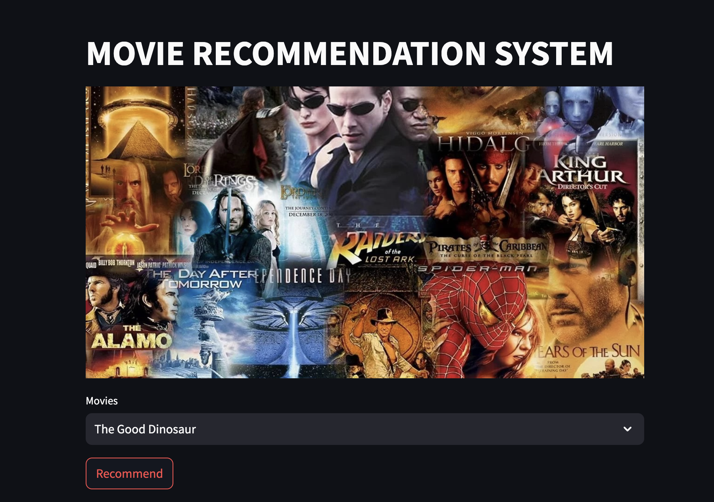

# Movie Recommendation System

This is a **Movie Recommendation System** built using **Streamlit**, **Pandas**, **Pickle**, and **The Movie Database (TMDb) API**. The system recommends movies based on a user's input by finding similar movies from a preprocessed dataset of movies.

## Features

- **Movie Search**: Users can select a movie from a dropdown list to get recommendations.
- **Movie Recommendations**: Similar movies are recommended based on the selected movie.
- **Posters Display**: Movie posters are fetched from The Movie Database (TMDb) API and displayed along with the recommended movies.
- **Error Handling**: Includes error handling for API request failures and missing posters.

## Requirements

- **Python 3.x**
- **Streamlit**
- **Pandas**
- **Pickle**
- **Requests**

You can install the required libraries using the following command:

```bash
pip install -r requirements.txt
```

## Files

- `movie_dict.pkl`: Contains movie data including the movie ID, title, and other relevant information.
- `similarity.pkl`: Contains similarity data between movies used to recommend similar movies.
- `movi_poster.jpg`: A sample image for the app header.

## How to Run

1. **Clone the repository**:

```bash
git clone https://github.com/your-username/movie-recommendation-system.git
```

2. **Navigate to the project directory**:

```bash
cd movie-recommendation-system
```

3. **Install the required dependencies**:

```bash
pip install -r requirements.txt
```

4. **Run the Streamlit app**:

```bash
streamlit run app.py
```

5. The app should now open in your default browser where you can use the movie recommendation system.

## API Key

The app uses the **TMDb API** to fetch movie posters. You can obtain your own **TMDb API key** by creating an account on their website: [TMDb API](https://www.themoviedb.org/settings/api). Once you have the API key, replace the existing one in the code.

```python
api_key = 'YOUR_API_KEY_HERE'
```

## How It Works

1. **Movie Selection**: The user selects a movie from a dropdown list.
2. **Recommendation**: The system matches the movie with the dataset and finds the top 5 similar movies based on pre-calculated similarity.
3. **Posters**: The system fetches movie posters from the TMDb API and displays them along with the movie titles.
4. **Error Handling**: If any issues arise (e.g., API failure or missing poster), an appropriate message is displayed.

## Example

Once the app is running, you can select a movie from the dropdown list and click the "Recommend" button. The app will display similar movie recommendations along with their posters.

## License

This project is licensed under the MIT License - see the [LICENSE](LICENSE) file for details.

---

Feel free to modify or expand the README according to your project needs!
